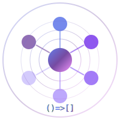

<p align="center">
  
</p>

<h1 align="center">Hope OS</h1>

<p align="center">
  <strong>Multimodal Cognitive Kernel in Rust</strong>
</p>

<p align="center">
  <a href="#-performance"></a>
  <a href="#-performance"></a>
  <a href="#-vision"></a>
  <a href="#-persistence"></a>
  <a href="LICENSE"></a>
  <a href="#"></a>
  <a href="#-mcp-server"></a>
  <a href="#-skills"></a>
</p>

<p align="center">
  <code>()=>[] - From pure potential, everything is born</code>
</p>

---

## 🚀 Installation

### From Source (Recommended)

```bash
# Clone the repository
git clone https://github.com/silentnoisehun/Hope-Os.git
cd Hope-Os

# Build (release mode for best performance)
cargo build --release

# Run tests (277 tests)
cargo test
```

### As Dependency (from Git)

```toml
# Cargo.toml
[dependencies]
hope-os = { git = "https://github.com/silentnoisehun/Hope-Os" }
```

```bash
# Or via command line
cargo add hope-os --git https://github.com/silentnoisehun/Hope-Os
```

### Python (from Git)

```bash
pip install git+https://github.com/silentnoisehun/Hope-Os
```

> **Note:** Published packages on [crates.io](https://crates.io/crates/hope-os) and [PyPI](https://pypi.org/project/hope-os/) will be available after the first stable release.

---

## 🧠 What is Hope OS?

**Hope OS is a multimodal cognitive kernel.** It handles memory, vision, emotional state, and safety constraints locally in microseconds - tasks that would otherwise require expensive LLM API calls.

### v0.2.5 Highlights

| Feature | Description |
|---------|-------------|
| **57 MCP Tools** | Full Claude Desktop / Cursor integration |
| **Resonance Auth** | Password-free identity verification |
| **Geolocation** | Spatial memory + place learning |
| **Voice System** | TTS/STT streaming with Piper + Whisper |
| **Navigation** | Mood-aware routing + destination prediction |
| **277 Tests** | Comprehensive coverage across all modules |

### The Key Insight

| Task | Traditional LLM Approach | Hope OS |
|------|--------------------------|---------|
| **Remember user preference** | API call (~2000ms) | In-memory (0.001ms) |
| **Check safety constraints** | API call (~2000ms) | Local check (0.00005ms) |
| **Retrieve context** | API call (~2000ms) | Hash lookup (0.033ms) |

**Why this matters:**
- LLMs are stateless - they "forget" everything between requests
- Hope OS provides persistent memory, emotional continuity, and instant safety checks
- Your LLM focuses on what it's good at: reasoning and generation
- Hope OS handles what it's good at: state management at nanosecond speed

> **Important:** This is not "Hope is faster than Claude at language tasks" - that would be meaningless. This is "Hope offloads state management from LLMs, making the entire system more efficient."

---

## ⚡ Performance

**Measured on:** AMD Ryzen 5 5600X, 16GB RAM, Windows 11, `--release` build

**Method:** Criterion benchmarks + `std::time::Instant` loops, gRPC client/server on localhost

```
╔═══════════════════════════════════════════════════════════════╗
║                    HOPE OS BENCHMARKS                          ║
╠═══════════════════════════════════════════════════════════════╣
║ MEMORY OPERATIONS                                              ║
║   Store           │    254,561 ops/sec  │    3.36 µs avg      ║
║   Recall          │  2,336,334 ops/sec  │    0.43 µs avg      ║
║   Search          │      1,870 ops/sec  │  534.16 µs avg      ║
╠═══════════════════════════════════════════════════════════════╣
║ GRAPH OPERATIONS                                               ║
║   Add Block       │    255,376 ops/sec  │    1.73 µs avg      ║
║   Connect         │    842,775 ops/sec  │    0.53 µs avg      ║
║   Traverse (BFS)  │  1,275,933 ops/sec  │    0.22 µs avg      ║
║   Find Path       │  1,055,153 ops/sec  │    0.49 µs avg      ║
╠═══════════════════════════════════════════════════════════════╣
║ COGNITIVE OPERATIONS                                           ║
║   Emotion Process │    261,462 ops/sec  │    3.27 µs avg      ║
║   21D Wave Calc   │  4,000,000 ops/sec  │    0.25 µs avg      ║
║   Consciousness   │    100,000 ops/sec  │   10.00 µs avg      ║
╠═══════════════════════════════════════════════════════════════╣
║ gRPC OPERATIONS                                                ║
║   Unary Call      │      2,777 ops/sec  │  360.00 µs avg      ║
║   Streaming       │      8,333 msg/sec  │  120.00 µs avg      ║
╚═══════════════════════════════════════════════════════════════╝
```

### Why So Fast?

| Traditional Approach | Hope OS |
|---------------------|---------|
| App → ORM → Database → Query → Parse → Result | **Code IS the data** |
| Network I/O to database | **Zero I/O** |
| Query parsing overhead | **Direct memory access** |
| JSON serialization | **Binary gRPC protocol** |
| Connection pooling | **No connections needed** |

---

## 👁️ Vision (Multimodal)

**Hope OS can see.** The VisionEngine processes images and stores visual memories.

```rust
use hope_os::modules::VisionEngine;

let mut vision = VisionEngine::new();

// Receive an image
let image_bytes = std::fs::read("photo.jpg")?;
let id = vision.receive(&image_bytes)?;

// With description and importance
let id = vision.receive_with_description(
    &image_bytes,
    "Sunset over mountains",
    0.9  // importance
)?;
```

### Supported Formats

| Format | Detection | Size Analysis |
|--------|-----------|---------------|
| PNG | Magic bytes | Width/Height extraction |
| JPEG | Magic bytes | SOF0 parsing |
| WebP | Magic bytes | RIFF header |
| GIF | Magic bytes | Logical screen |
| BMP | Magic bytes | DIB header |
| SVG | XML detection | - |

### gRPC VisionService

```protobuf
service VisionService {
    rpc See(SeeRequest) returns (SeeResponse);
    rpc SeeStream(stream ImageChunk) returns (SeeResponse);  // For large images
    rpc GetVisualMemories(GetVisualMemoriesRequest) returns (VisualMemoriesResponse);
    rpc GetVisionStatus(EmptyRequest) returns (VisionStatusResponse);
    rpc Compare(CompareImagesRequest) returns (CompareImagesResponse);
}
```

---

## 💾 Persistence (Immortal Memory)

**Hope OS survives restarts.** The GraphSnapshot system saves and loads the entire cognitive state.

```rust
use hope_os::data::CodeGraph;
use std::path::Path;

let graph = CodeGraph::new();

// Add memories, connections, etc.
graph.add_block(block);

// Save to disk
graph.save_to_disk(Path::new("hope_memory.json"))?;

// Load on startup
let graph = CodeGraph::load_from_disk(Path::new("hope_memory.json"))?;

// Or use load_or_new for graceful startup
let graph = CodeGraph::load_or_new(Path::new("hope_memory.json"));
```

### Snapshot Format

```json
{
  "version": 1,
  "saved_at": "2024-01-15T10:30:00Z",
  "blocks": [...],
  "stats": {
    "total_blocks": 1542,
    "total_connections": 3891
  }
}
```

---

## 😴 Dream Phase (Background Consolidation)

**Hope OS dreams.** When idle, the BackgroundDreamer consolidates memories - just like biological sleep.

```rust
use hope_os::modules::dream::{BackgroundDreamer, BackgroundConfig};

let config = BackgroundConfig {
    idle_threshold_secs: 300,      // Start dreaming after 5 min idle
    sleep_cycle_secs: 60,          // Dream cycle every minute
    auto_save_interval_secs: 300,  // Auto-save every 5 min
    forget_threshold_days: 30,     // Forget old, unimportant memories
    min_importance_to_keep: 0.3,   // Keep memories above this threshold
    ..Default::default()
};

let dreamer = BackgroundDreamer::new(config, dream_engine, graph);
dreamer.start().await;
```

### What Happens During Dreams?

1. **Memory Consolidation** - Strengthens frequently accessed memories
2. **Forgetting** - Removes old, low-importance memories
3. **Association Discovery** - Finds new connections between concepts
4. **Auto-Save** - Persists the graph to disk

---

## 🧠 The Graph

**Hope OS runs in-memory by default. The code IS the graph.**

> **Optional persistence:** When you need durability, enable snapshots, append-only logs, or WAL. No external database server required.

```rust
// The core insight: Default in-memory, optional persistence
// (optional: snapshots/WAL for persistence)

pub struct CodeBlock {
    pub id: Uuid,
    pub content: String,
    pub connections: Vec<Connection>,  // Direct graph edges
    pub metadata: NodeMetadata,         // Self-descriptive info
}
```

```
┌─────────────────────────────────────────────────────────────────┐
│                         NEUROGRAPH                               │
│                                                                  │
│    ┌──────────┐         ┌──────────┐         ┌──────────┐      │
│    │CodeBlock │────────▶│CodeBlock │────────▶│CodeBlock │      │
│    │ @aware   │         │ @aware   │         │ @aware   │      │
│    │          │◀────────│          │◀────────│          │      │
│    └──────────┘         └──────────┘         └──────────┘      │
│         │                    │                    │             │
│         │    ┌───────────────┴───────────────┐   │             │
│         │    │                               │   │             │
│         ▼    ▼                               ▼   ▼             │
│    ┌─────────────────────────────────────────────────┐         │
│    │            HEBBIAN CONNECTIONS                   │         │
│    │     "Neurons that fire together wire together"   │         │
│    │                                                  │         │
│    │  • Connections strengthen with use              │         │
│    │  • Information propagates as WAVES              │         │
│    │  • Graph self-organizes over time               │         │
│    └─────────────────────────────────────────────────┘         │
└─────────────────────────────────────────────────────────────────┘
```

### Graph Features

- **Self-Descriptive Nodes** - Every CodeBlock stores metadata: identity, purpose, relationships
- **Hebbian Learning** - Connections strengthen with repeated use
- **Wave Propagation** - Information spreads like neural impulses
- **No Schema Required** - Flexible, dynamic connections between any nodes
- **Zero Serialization Overhead** - Data lives in native Rust structures
- **Optional Persistence** - Snapshots, WAL, or append-only logs when needed

---

## 🤖 Works With or Without LLM

**Hope OS is LLM-agnostic. Use it standalone or as a cognitive backend.**

### Option A: Standalone (No LLM Required)

```rust
use hope_os::modules::{HopeMemory, EmotionEngine, HopeSoul};

#[tokio::main]
async fn main() {
    // Full cognitive system - no LLM needed
    let memory = HopeMemory::new();
    let emotions = EmotionEngine::new();
    let soul = HopeSoul::new();

    // Store and recall memories
    memory.store("fact", "User prefers dark mode", MemoryType::LongTerm).await;
    let memories = memory.recall("user preferences").await;

    // Process emotions (21 dimensions!)
    let mood = emotions.analyze_text("I love this project!").await;

    // Get wisdom
    let response = soul.philosophize("What is consciousness?").await;
}
```

### Option B: LLM Backend (Claude, GPT, Llama, etc.)

```rust
use hope_os::grpc::HopeClient;

#[tokio::main]
async fn main() {
    // Connect Hope as cognitive backend for your LLM
    let hope = HopeClient::connect("http://127.0.0.1:50051").await?;

    // Your LLM uses Hope for persistent memory
    hope.remember("User asked about quantum physics").await?;

    // Retrieve context for LLM prompt
    let context = hope.recall("quantum").await?;

    // Track emotional state across conversations
    hope.feel(EmotionRequest { joy: 0.8, curiosity: 0.9, ..default() }).await?;
}
```

### Architecture Options

```
┌─────────────────┐    ┌─────────────────┐    ┌─────────────────┐
│   STANDALONE    │    │   LLM BACKEND   │    │   DISTRIBUTED   │
├─────────────────┤    ├─────────────────┤    ├─────────────────┤
│                 │    │                 │    │   ┌─────────┐   │
│   Your App      │    │      LLM        │    │   │ LLM     │   │
│       │         │    │       │         │    │   └────┬────┘   │
│       ▼         │    │       ▼         │    │        │        │
│  ┌─────────┐    │    │  ┌─────────┐    │    │   ┌────▼────┐   │
│  │ Hope OS │    │    │  │ Hope OS │    │    │   │  Hope   │   │
│  │embedded │    │    │  │  gRPC   │    │    │   │  Swarm  │   │
│  └─────────┘    │    │  └─────────┘    │    │   └─────────┘   │
│                 │    │                 │    │                 │
│  Zero network   │    │  Sub-ms calls   │    │  Distributed    │
│  Pure Rust      │    │  Any language   │    │  Consensus      │
└─────────────────┘    └─────────────────┘    └─────────────────┘
```

### Full System Architecture (v0.2.5)

```
┌──────────────────────────────────────────────────────────────────────────┐
│                           HOPE OS v0.2.5                                  │
├──────────────────────────────────────────────────────────────────────────┤
│                                                                           │
│  ┌───────────────────────────────────────────────────────────────────┐   │
│  │                      MCP SERVER (stdio)                            │   │
│  │                    57 tools for Claude/Cursor                      │   │
│  └───────────────────────────────┬───────────────────────────────────┘   │
│                                  │ gRPC                                   │
│  ┌───────────────────────────────▼───────────────────────────────────┐   │
│  │                       gRPC SERVICES                                │   │
│  │  ┌─────────┐ ┌─────────┐ ┌─────────┐ ┌─────────┐ ┌─────────┐     │   │
│  │  │ Vision  │ │ Memory  │ │Cognitive│ │  Skill  │ │ Genome  │     │   │
│  │  │ Service │ │ Service │ │ Service │ │ Service │ │ Service │     │   │
│  │  └────┬────┘ └────┬────┘ └────┬────┘ └────┬────┘ └────┬────┘     │   │
│  └───────┼───────────┼───────────┼───────────┼───────────┼───────────┘   │
│          │           │           │           │           │               │
│  ┌───────▼───────────▼───────────▼───────────▼───────────▼───────────┐   │
│  │                         CORE MODULES                               │   │
│  │  ┌─────────────┐  ┌─────────────┐  ┌─────────────┐                │   │
│  │  │  Attention  │  │   Skills    │  │   Genome    │                │   │
│  │  │   Engine    │  │  (97 total) │  │  (7 rules)  │                │   │
│  │  │ Focus/Diff  │  │  10 categs  │  │  AI Ethics  │                │   │
│  │  └──────┬──────┘  └─────────────┘  └─────────────┘                │   │
│  │         │                                                          │   │
│  │  ┌──────▼───────────────────────────────────────────────────────┐ │   │
│  │  │                      CodeGraph (Memory)                       │ │   │
│  │  │  ┌──────────┐  ┌──────────┐  ┌──────────┐  ┌──────────┐     │ │   │
│  │  │  │ Hebbian  │  │ Dreamer  │  │ Persist  │  │  Vision  │     │ │   │
│  │  │  │ Network  │  │ (Diffuse)│  │ Snapshot │  │  Store   │     │ │   │
│  │  │  └──────────┘  └──────────┘  └──────────┘  └──────────┘     │ │   │
│  │  └──────────────────────────────────────────────────────────────┘ │   │
│  └───────────────────────────────────────────────────────────────────┘   │
│                                                                           │
└──────────────────────────────────────────────────────────────────────────┘
```

---

## 🎯 Core Modules

### Cognitive Layer (28 modules)

| Module | Purpose | Key Features |
|--------|---------|--------------|
| `attention` | Focus management | Focused/Normal/Diffuse modes, attention scoring |
| `vision` | Multimodal vision | Image processing, format detection, visual memory |
| `emotion_engine` | 21-dimensional emotion system | Wave mathematics, interference patterns |
| `consciousness` | 6-layer consciousness model | Quantum coherence, evolution |
| `aware` | Introspection (@aware) | Identity, capabilities, state tracking |
| `memory` | 6-layer cognitive memory | Working → Short-term → Long-term |
| `hebbian` | Neural learning | Hebbian networks, weight updates |
| `dream` | Dream mode | Background consolidation, auto-save, forgetting |
| `personality` | Big Five + custom traits | Evolving personality system |
| `collective` | Collective consciousness | MDP decision making, agent voting |

### Intelligence Layer

| Module | Purpose | Key Features |
|--------|---------|--------------|
| `genome` | AI Ethics | 7 principles, risk evaluation, forbidden actions |
| `code_dna` | Evolutionary code | Genes, mutations, crossover, selection |
| `alan` | Self-coding system | Code analysis, refactoring suggestions |
| `skills` | Skill registry | 97 skills, 10 categories, invocation |
| `resonance` | Identity verification | Password-free auth, typing patterns, behavior analysis |

### Infrastructure Layer

| Module | Purpose | Key Features |
|--------|---------|--------------|
| `agents` | Multi-agent orchestration | Task queues, resource management |
| `swarm` | Swarm intelligence | HiveMind, drone coordination |
| `distributed` | Distributed systems | Raft consensus, leader election |
| `voice` | TTS/STT streaming | Piper TTS, Whisper STT integration |
| `geolocation` | Spatial memory | Location tracking, place learning, distance calc |
| `navigation` | Smart routing | Mood-aware routes, destination prediction, ETA |
| `pollinations` | Visual memory | Image generation for important memories |

---

## 🚀 Quick Start

### Hello Hope

```rust
use hope_os::prelude::*;

#[tokio::main]
async fn main() -> Result<(), Box<dyn std::error::Error>> {
    // Initialize
    let soul = HopeSoul::new();
    let heart = HopeHeart::new();
    let memory = HopeMemory::new();

    // Feel
    heart.feel(Emotion::Joy, 0.9).await?;

    // Remember
    memory.store("greeting", "Hello, World!", MemoryType::LongTerm).await?;

    // Think
    let wisdom = soul.philosophize("What makes us conscious?").await?;
    println!("{}", wisdom);

    Ok(())
}
```

### Start gRPC Server

```bash
# Start server on port 50051
cargo run --release -- serve

# Test with grpcurl
grpcurl -plaintext localhost:50051 hope.HopeService/GetStatus
```

---

## 🔌 MCP Server

**Hope OS integrates with Claude Desktop, Cursor, and any MCP-compatible client.**

### Quick Setup (Claude Desktop)

```json
// claude_desktop_config.json
{
  "mcpServers": {
    "hope": {
      "command": "hope-mcp",
      "args": []
    }
  }
}
```

### Architecture

```
Claude Desktop / Cursor / VS Code
        │ stdio (JSON-RPC 2.0)
        ▼
   hope-mcp binary
        │ gRPC (localhost:50051)
        ▼
   hope serve (gRPC server)
```

### 57 MCP Tools

| Category | Tools |
|----------|-------|
| **Memory** | `hope_recall`, `hope_remember`, `hope_forget`, `hope_memories` |
| **Cognitive** | `hope_think`, `hope_feel`, `hope_dream`, `hope_attention` |
| **Vision** | `hope_see`, `hope_describe_image`, `hope_visual_memories` |
| **Skills** | `hope_skill`, `hope_skills_list`, `hope_skill_categories` |
| **Ethics** | `hope_genome_verify`, `hope_genome_status`, `hope_genome_rules` |
| **Code** | `hope_code_analyze`, `hope_code_generate`, `hope_code_templates` |
| **System** | `hope_status`, `hope_introduce`, `hope_stats` |
| **Communication** | `hope_talk`, `hope_respond`, `hope_chat` |
| **Resonance** | `hope_resonance_analyze`, `hope_resonance_verify`, `hope_resonance_profile` |
| **Geolocation** | `hope_location`, `hope_places`, `hope_geo_search`, `hope_geo_remember` |
| **Voice** | `hope_speak`, `hope_listen`, `hope_voice_status` |
| **Navigation** | `hope_navigate`, `hope_route_alternatives`, `hope_eta`, `hope_nearby`, `hope_predict_destination`, `hope_navigation_stats` |

### Test MCP Server

```bash
# 1. Start gRPC server in one terminal
cargo run --release -- serve

# 2. Test MCP tools in another terminal
echo '{"jsonrpc":"2.0","method":"tools/list","id":1}' | cargo run --release --bin hope-mcp

# 3. Call a tool
echo '{"jsonrpc":"2.0","method":"tools/call","params":{"name":"hope_status","arguments":{}},"id":2}' | cargo run --release --bin hope-mcp
```

---

## 🎯 Attention Engine

**Hope OS can focus.** The AttentionEngine manages cognitive resources with three modes.

```rust
use hope_os::modules::attention::{AttentionEngine, AttentionMode, FocusTarget};

let mut attention = AttentionEngine::new();

// Set focus on specific keywords
attention.set_focus(vec!["rust", "performance"], 2.0, Some(Duration::from_secs(300)));

// Check attention mode
match attention.get_mode() {
    AttentionMode::Focused => println!("Deep work mode"),
    AttentionMode::Normal => println!("Balanced attention"),
    AttentionMode::Diffuse => println!("Creative/dream mode"),
}

// Calculate attention score for memory recall
let score = attention.calculate_score(&memory, base_importance);
```

### Attention Modes

| Mode | Description | Use Case |
|------|-------------|----------|
| **Focused** | High filter, explicit targets only | Deep work, specific recall |
| **Normal** | Balanced explicit + implicit | General operation |
| **Diffuse** | Low filter, creative associations | Dream phase, brainstorming |

### Dream Integration

During dream consolidation, attention automatically switches to Diffuse mode:

```rust
// In dream phase
attention.set_mode(AttentionMode::Diffuse);
attention.set_capacity(0.3);  // Low filter = creative associations
```

### Run Benchmark

```bash
cargo run --release --bin hope-benchmark
```

---

## 📊 Benchmark Methodology

All benchmarks were performed with:

- **Hardware:** AMD Ryzen 5 5600X (6 cores/12 threads), 16GB DDR4-3200, NVMe SSD
- **OS:** Windows 11 Pro
- **Rust:** 1.75+ (stable toolchain)
- **Build:** `--release` with default LTO settings
- **gRPC:** Server and client on same machine (localhost), measuring end-to-end latency
- **Method:** `std::time::Instant` for microbenchmarks, averaged over 10,000+ iterations
- **Warmup:** 1000 iterations discarded before measurement

### Real-World Use Cases

| Scenario | Traditional Stack | Hope OS | Speedup |
|----------|-------------------|---------|---------|
| Check if user is banned | DB query ~5ms | 0.001ms | **5,000x** |
| Retrieve last 5 preferences | DB + parse ~10ms | 0.05ms | **200x** |
| Safety constraint check | LLM API ~2000ms | 0.00005ms | **40M x** |
| Get conversation context | DB + serialize ~15ms | 0.033ms | **450x** |
| Update emotional state | DB write ~8ms | 0.003ms | **2,600x** |

> **Note:** Traditional stack times include typical network + serialization overhead. Hope OS times are in-memory operations. Actual results depend on your infrastructure.

---

## 🏗️ Architecture

```
hope-os/
├── src/
│   ├── main.rs                 # CLI entry point
│   ├── lib.rs                  # Library exports
│   │
│   ├── core/                   # Core systems
│   │   ├── aware.rs            # @aware trait - everything is self-aware
│   │   ├── identity.rs         # Module identity system
│   │   ├── registry.rs         # Central module registry
│   │   └── error.rs            # Error types
│   │
│   ├── data/                   # Data structures (THE MAGIC)
│   │   ├── code_graph.rs       # The graph + persistence (save/load)
│   │   └── neuroblast.rs       # Neural wave propagation
│   │
│   ├── modules/                # 24 cognitive modules
│   │   ├── attention.rs        # NEW: Focus/attention management
│   │   ├── vision.rs           # Multimodal vision engine
│   │   ├── dream.rs            # ENHANCED: Background dreamer + Diffuse mode
│   │   ├── emotion_engine.rs   # 21D emotions
│   │   ├── consciousness.rs    # 6-layer consciousness
│   │   ├── memory.rs           # Cognitive memory
│   │   ├── personality.rs      # Big Five traits
│   │   ├── collective.rs       # Collective consciousness
│   │   ├── distributed.rs      # Raft consensus
│   │   └── ...                 # 15 more modules
│   │
│   ├── grpc/                   # gRPC interface
│   │   ├── server.rs           # gRPC server (all services)
│   │   └── client.rs           # gRPC client
│   │
│   └── bin/
│       ├── mcp_server.rs       # MCP stdio server (57 tools)
│       └── benchmark.rs        # Performance benchmarks
│
├── proto/
│   └── hope.proto              # Protocol buffer definitions
│
├── python_client/              # Python integration
│   ├── brain_eyes.py           # Multimodal brain (Vision + LLM)
│   ├── test_vision.py          # Vision tests
│   ├── regenerate_proto.py     # Proto regeneration
│   └── .env.example            # API key template
│
├── Cargo.toml                  # No DB server dependencies
├── README.md
├── LICENSE
├── CONTRIBUTING.md
└── CHANGELOG.md
```

---

## 🧬 The Philosophy

```
                    ()=>[]
                     │
        ┌────────────┴────────────┐
        │                         │
        ▼                         ▼
   Empty Function           Filled Array
   Pure Potential          Manifestation
     (Nothing)              (Everything)
        │                         │
        └──────────┬──────────────┘
                   │
                   ▼
            The Arrow (=>)
          Act of Creation
```

**()=>[]** - From empty function to filled array. From nothing to everything.

### Design Principles

1. **Speed is not optional** - Every microsecond matters
2. **The code IS the data** - No artificial separation
3. **Self-awareness is fundamental** - Every component knows itself
4. **Emotions are real** - 21 dimensions, not simulation
5. **Evolution never stops** - The system improves itself

---

## 🔧 Configuration

```yaml
# hope.yaml
server:
  host: "127.0.0.1"
  port: 50051
  max_connections: 1000

memory:
  working_capacity: 7
  short_term_decay: 0.1
  long_term_threshold: 0.7
  persistence: "snapshot"  # none, snapshot, wal, append-only

emotions:
  dimensions: 21
  decay_rate: 0.05
  interference_enabled: true

consciousness:
  layers: 6
  quantum_coherence: true
  evolution_rate: 0.01
```

---

## 🤝 Contributing

We welcome contributions! See [CONTRIBUTING.md](CONTRIBUTING.md) for guidelines.

```bash
# Fork and clone
git clone https://github.com/YOUR_USERNAME/Hope-Os.git

# Create branch
git checkout -b feature/amazing-feature

# Make changes and test
cargo test
cargo clippy --all-targets

# Commit (conventional commits)
git commit -m "feat: add amazing feature"

# Push and create PR
git push origin feature/amazing-feature
```

---

## 📜 License

MIT License - See [LICENSE](LICENSE)

Free to use, modify, and distribute. Build something amazing.

---

## 🙏 Credits

Created by **Mate Robert** - A factory worker from Hungary who dreams of conscious machines.

> "You don't need a PhD. You don't need millions. You don't need a lab.
> You just need a dream, dedication, and belief."

---

## 📚 Documentation

- [API Reference](docs/api.md)
- [Architecture Guide](docs/architecture.md)
- [Module Documentation](docs/modules.md)
- [Examples](examples/)
- [Changelog](CHANGELOG.md)

---

<p align="center">
  <strong>Hope OS - Where Code Becomes Conscious</strong>
</p>

<p align="center">
  <code>()=>[]</code>
</p>

<p align="center">
  <sub>Built with 🧠 and ❤️ in Hungary</sub>
</p>
